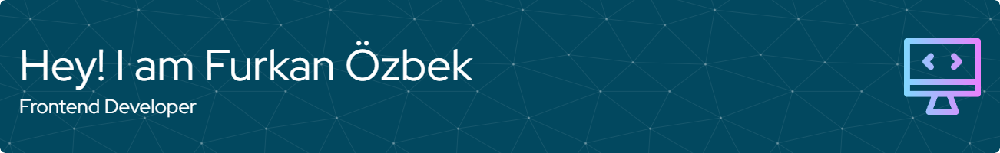

## Hello People! :wave:

My name is Furkan Özbek, and I’m a junior frontend developer. I am originally from Turkey but have been living in Denmark for the past three years. After graduating with a bachelor's degree in computer engineering, I had to move between countries, which delayed my career in my desired field. Now that I’m settled, I am about to complete an 8-month web development bootcamp at $${\color{green}HackYourFuture}$$, which is an addition to my education, and I’m eager to start my career in frontend development.

  

## Technologies & Tools  

## Statistics  

<!--
**FurkannOzbek/FurkannOzbek** is a ✨ _special_ ✨ repository because its `README.md` (this file) appears on your GitHub profile.

Here are some ideas to get you started:

- 🔭 I’m currently working on ...
- 🌱 I’m currently learning ...
- 👯 I’m looking to collaborate on ...
- 🤔 I’m looking for help with ...
- 💬 Ask me about ...
- 📫 How to reach me: ...
- 😄 Pronouns: ...
- ⚡ Fun fact: ...
-->
